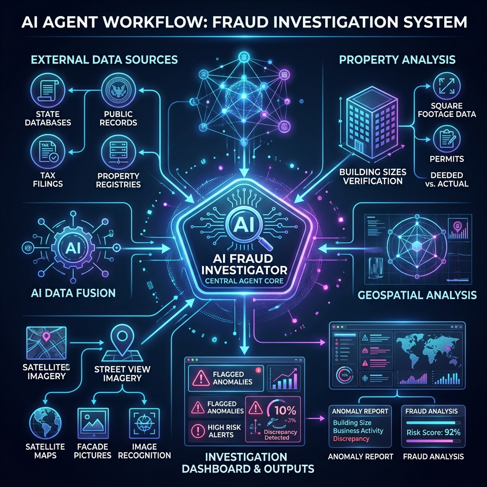

# 🔍 Surelock Homes: AI Fraud Investigation Agent



Surelock Homes is an autonomous AI agent designed to investigate subsidized childcare providers. It acts like a digital forensic auditor, pulling public records to find facilities where the paperwork doesn't match the physical reality.

## 🎯 What it does

- **Licensing Checks:** Pulls active childcare provider data from state databases (like Illinois DCFS).
- **Property Math:** Cross-references a facility's licensed capacity against the actual square footage of the building using County GIS records.
- **Visual Verification:** Analyzes Google Street View imagery to check if the address looks like a real daycare or a vacant building.
- **Business Verification:** Checks Google Places and the Secretary of State to confirm if the business is actively operating and legally registered.
- **Live Narration:** Streams its thoughts and investigation steps directly to the dashboard in real-time.

## 🚀 How to Run It

1. **Install Python Packages:**
   ```bash
   pip install -r requirements.txt
   ```

2. **Get your API Keys:**
   - **OpenRouter API Key (Required):** Sign up at [openrouter.ai](https://openrouter.ai) to use Claude for the agent's logic.
   - **Google Maps API Key (Optional):** Enable Geocoding, Places, and Street View Static APIs in Google Cloud for visual checks.

3. **Launch the Dashboard:**
   ```bash
   streamlit run app.py
   ```
   *Note: Just paste your API keys right into the sidebar once the app opens!*

## 🧠 Why building code math?

The core of Surelock Homes relies on hard physical math rather than AI guessing. 

- State laws dictate a minimum usable square footage per child (e.g., 35 sq ft). 
- If a 900 sq ft residential home is claiming a licensed capacity of 50 kids, it is mathematically impossible. 
- Using physical laws keeps the investigation objective, fair, and free of bias.

## ⚠️ What it CAN'T do

- **Attendance Fraud:** It cannot tell if a provider is billing the state for children who aren't showing up. This requires private, non-public billing records.
- **Legal Conclusions:** All findings are investigative leads and anomalies, not definitive proof of a crime.
